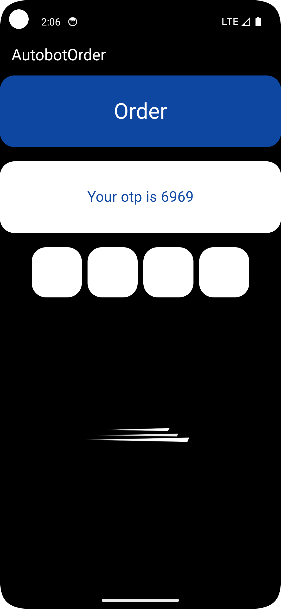

# BotOrder

**Created By:** Shubham Choudhary  

BotOrder is an innovative mobile application designed to manage autonomous robot operations seamlessly. The app bridges communication between users and autonomous robots using advanced technologies, providing efficient control and monitoring.

App Screenshots
--------

  

## Features

- **Robot Communication**:
  - Real-time communication with robots via **WebSocket** and **BLE (Bluetooth Low Energy)** protocols.
  - Efficient handling of robot commands and responses.

- **Task Persistence**:
  - Local storage of operational data using **SharedPreferences** for offline capabilities.

- **Control and Monitoring**:
  - Robot control through an intuitive interface.
  - Live updates and task feedback from the robot.

- **Secure Connections**:
  - **SSH** integration for secure remote management and command execution.

- **Cross-Platform Support**:
  - Developed with **Dart**, ensuring compatibility across multiple platforms.

## Technology Stack

- **Dart**: Primary programming language for app development.
- **WebSocket**: Enables real-time, bi-directional communication between the app and the robot.
- **BLE (Bluetooth Low Energy)**: Provides a low-power, wireless communication channel for robot control.
- **SharedPreferences**: Used for local storage of robot task data, ensuring offline usability.
- **SSH (Secure Shell)**: Ensures secure and encrypted communication for remote robot operations.

## Installation and Setup

1. Clone the repository to your local machine.
2. Navigate to the project directory.
3. Install the required dependencies using `flutter pub get`.
4. Ensure BLE, WebSocket, and SSH configurations match your robot's specifications.
5. Run the app on a compatible device.

## Usage

- Connect the app to the autonomous robot via **WebSocket** or **BLE**.
- Use the control panel to send commands and monitor tasks in real-time.
- Store task data locally using **SharedPreferences** for offline operation.
- Manage robot operations securely using **SSH** for remote execution.

## Future Enhancements

- Integration with additional robotics platforms.
- Advanced data analytics for robot performance monitoring.
- Support for multiple robots within a single app.

## DemoVideo

---

**Developed and Edited By:** Shubham Choudhary
